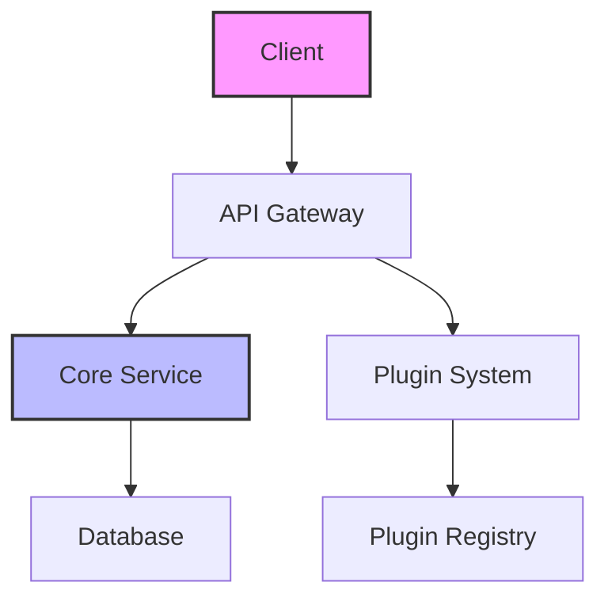

# Architecture Overview

This document explains the high-level architecture of the project.

## System Overview



## Core Components

### API Gateway

The API Gateway serves as the single entry point for all client requests. It handles:

- **Authentication** - Validates user credentials and tokens
- **Rate Limiting** - Prevents abuse and ensures fair usage
- **Request Routing** - Directs requests to appropriate services
- **Response Caching** - Improves performance for common queries

### Core Service

The Core Service contains the main business logic:

```js
// Simplified example
class CoreService {
  async processRequest(request) {
    // Validate input
    const validated = await this.validate(request)
    
    // Apply business logic
    const result = await this.process(validated)
    
    // Emit events for plugins
    await this.emit('processed', result)
    
    return result
  }
}
```

### Plugin System

The plugin system allows extending functionality without modifying core code:

- **Hook System** - Plugins can hook into lifecycle events
- **Isolation** - Each plugin runs in its own context
- **Hot Reload** - Plugins can be updated without downtime

## Data Flow

1. **Request Arrival** - Client sends request to API Gateway
2. **Authentication** - Gateway validates credentials
3. **Processing** - Core Service handles business logic
4. **Plugin Execution** - Relevant plugins are triggered
5. **Response** - Result sent back to client

## Design Principles

### Modularity

Each component has a single, well-defined responsibility. This makes the system easier to:
- Understand
- Test
- Maintain
- Extend

### Scalability

The architecture supports horizontal scaling:
- Stateless services can be replicated
- Database can be sharded
- Caching reduces load

### Security

Security is built-in at every level:
- Input validation at the gateway
- Principle of least privilege for services
- Encrypted communication between components

## Trade-offs

### Performance vs Flexibility

We chose a plugin system that adds slight overhead but provides tremendous flexibility. For most use cases, the performance impact is negligible.

### Complexity vs Features

The modular architecture adds some complexity but enables features like:
- Hot reloading
- A/B testing
- Gradual rollouts

## Future Considerations

As the system grows, we're considering:
- Microservice decomposition for very large deployments
- Event sourcing for complex audit requirements
- GraphQL federation for more flexible APIs